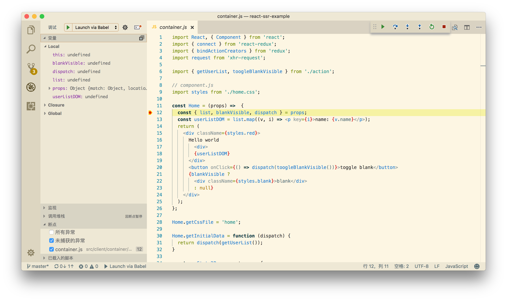

# React SSR step-by-step

一步一步来实现 react 的服务端渲染。

## How to use

> $ yarn && npm run build

Then use *Visual studio code* to debug isomorphic react.



## Expectation

实现react在服务端的渲染，同时支持额外拓展，包括 react-router，redux，css-module，react-addons-*。

## First Step

在实现服务端渲染之前，我们需要先实现一个最简单的react组件的展示过程。

这一步包含了最基本的react组件的显示，同时使用webpack-dev-server做服务器。

```js
//container.jsx
import React, { Component } from 'react';

export class Hello extends Component {
  render() {
    return (
      <div>
        Hello world
      </div>
    )
  }
}

export default Hello;
```

```js
// render.js
import ReactDOM from 'react-dom';
import React from 'react';

import Home from './container/home/container';

ReactDOM.render(<Home />, document.getElementById('app'));
```

```js
//webpack.config.js
const webpack = require('webpack');
const HtmlWebpackPlugin = require('html-webpack-plugin');
const path = require('path');

const config = {
  entry: path.resolve(__dirname, '../src/render.js'),
  output: {
    path: path.resolve(__dirname, '../statics'),
    filename: 'bundle.js',
    publicPath: '/',
  },
  resolve: {
    extensions: ['.js','.jsx']
  },
  module: {
    rules: [{
      test: /jsx?/,
      use: {
        loader: 'babel-loader',
        options: {
          presets: ['es2015', 'react'],
          plugins: [['transform-runtime']]
        }
      },
      exclude: /node_modules/,
    }]
  },
  plugins: [
    new HtmlWebpackPlugin({
      filename: 'index.html',
      template: path.join(__dirname, './tmpl.html'),
      inject: true,
    })
  ],
  devServer: {
    port: 8388,
  }
};

module.exports = config;
```

> webpack-dev-server --config webpack/webpack.config.js --port 8388 --inline

# Step 2 - Simpe server side render

服务端渲染，实际上就是让 react 在服务端将我们使用es6语法写的组件渲染为字符串的一个过程。在这个过程中，我们首先需要实现在服务端使用 es6 的语法。

我们可以使用 `babel-node` 来实现在服务端使用es6 module system。我们使用 visual studio code 来进行调试：

```json
// .vscode/launch.json
{
  "version": "0.2.0",
  "configurations": [
    {
      "type": "node",
      "request": "launch",
      "name": "Launch via Babel",
      "program": "${workspaceRoot}/server/server.js",
      "runtimeExecutable": "${workspaceRoot}/node_modules/.bin/babel-node",
      "cwd": "${workspaceRoot}"
    }
  ]
}
```

然后我们再实现一个最简单的ssr。我们可以使用 `react-dom/server` 提供的 `renderToString` 方法，将我们使用 *es6* 语法编写的react组件翻译为字符串。

```js
import http from 'http';
import path from 'path';
import React from 'react';
import { renderToString } from 'react-dom/server';
import Home from '../src/container/home/index.js';

const PORT = 8388;

const serve = http.createServer((req, res) => {
  const dom = renderToString(<Home />);
  res.end(dom);
});

serve.listen(PORT, () => {
  console.log(`server start on port ${PORT}`);
});

export default serve;
```
执行脚本：
> node server/server.js

这就是一个服务端渲染的实现，但这还远远不够。我们还需要实现对路由和数据存储，数据请求的功能。

在此之前，我们还可以做一个小测试，测试一下到底是服务端渲染快还是客户端渲染快。我们可以使用 `window.performance.now()` 或者 `console.time()` 来做测试。为了统一标准，我们这里使用 `console.time`。我们在 *Hello* 组件里面渲染10000个div 来进行实验。

```js

export class Hello extends Component {
  constructor(props) {
    super(props);
  }

  componentWillMount() {
    console.time('mount');
  }

  componentDidMount(){
    console.timeEnd('mount');
  }

  render() {
    return (
      <div>
        Hello world
        {Object.keys(Array.from({ length: 10000 }))
          .map((i,index) => <div key={index}>{index}</div>)}
      </div>
    )
  }
}·
```

同样，我们把服务端代码也改一下：

```js
// server.js
...
const serve = http.createServer((req, res) => {
  console.time('mount');
  const dom = renderToString(<Home />);
  console.timeEnd('mount');
  res.end(dom);
});
...
```

分别使用 webpack-dev-server 和 `node server/server.js` 来运行我们的react代码，可以发现, 浏览器渲染大约需要 `mount: 303.55322265625ms`，而服务端掉用 `renderToString` 只需要 `mount: 172.4598450064659ms`，可见服务端渲染确实快了不少。

### Step 3 - Add react router

我们现在在我们的代码中加入 *react-router*。我们使用最新的 v4 版本。由于 v4 和 v2 版本差距非常大，这次顺便学习一下新的api。

我们设计一个最简单的路由结构:

>  - / -> <Root />
   - /home -> <Home />
   - /profile -> <Profile />

```js
// routes.js

import AppRoot from './container/root';
import Home from './container/home';
import Profile from './container/profile';

const routes = [
  {
    path: '/',
    exact: true,
    component: AppRoot
  },
  {
    path: '/home',
    component: Home
  },
  {
    path: '/profile',
    component: Profile
  }
];

export default routes;
```

对于服务端代码，我们对于所有 `Content-Type: text/html` 的请求都由 `react-dom/server` 处理。实际上我们就是在 render `<Router>` 的时候，将用户当前的url传递给 `react-router`, 由它来加载并渲染不同的组件

```js
// server.js

import http from 'http';
import path from 'path';
import React from 'react';
import { renderToString } from 'react-dom/server';
import { renderRoutes } from 'react-router-config';
import { StaticRouter } from 'react-router-dom';
import routers from '../src/routers';

const PORT = 8388;

const serve = http.createServer((req, res) => {
  const context = {};
  const content = renderToString(
    <StaticRouter location={req.url} context={context}>
      {renderRoutes(routers)}
    </StaticRouter>
  );
  res.end(content);
});

serve.listen(PORT, () => {
  console.log(`server start on port ${PORT}`);
});

export default serve;
```

# Step 4 - Add css

这一步，我们要处理一下css，实际上css我们也可以当作是普通文本处理。我们可以把所有样式都写在一个文件里。 然后在加载网页的时候插入到 `<head>` 标签里面。
但是我们正常来说并不是全部都写在一个文件里面的，可能每个组件都有自己的css，然后写一个css入口文件，通过`@import` 来引入；也会选择使用 webpack 提供的 `css-loader` 将所有css文件自动打包到一个文件里面；也可能使用 css-module，postcss，scss这样的工具或者技术。所以处理css也是react ssr的一个难点。

我们按照正常使用 css-module 的技术来写组件，直接在组件文件上部使用 `import style from '*.[css/scss/less]'` 就可以了。 但是server端是不能直接引入css文件的。这里我们使用 [babel-plugin-css-modules-tranform](https://github.com/michalkvasnicak/babel-plugin-css-modules-transform) 来实现import css 同时实现 css-modules。这个plugin可以实现在文件内 将 `.red { color: red }` 编译成 `Object {red: "home__red___1x-zZ"}` 的形式，同时在指定目录生成css文件。我们要做的就是正常书写组件，然后在服务端找到当前渲染出的组件的样式文件，添加到页面上，可以写内嵌css或者外链css。我们可以在组件上挂载一个静态属性来找到特定的样式文件。

### 配置.babelrc

```json
{
  "plugins": [
    ["css-modules-transform", {
      "extensions": [
        ".css"
      ],
      "extractCss": {
        "dir": "./dist/css/",
        "filename": "[name].css",
        "generateScopedName": "[name]__[local]___[hash:base64:5]"
      }
    }]
  ]
}
```

### 改写一下 `<Home>` 组件

```js
// src/container/home/container.js
import React, { Component } from 'react';
import styles from './home.css';

export class Hello extends Component {
  constructor(props) {
    super(props);
  }

  componentWillMount() {
    var global,window;
    console.log(styles)
  }
  render() {
    return (
      <div className={styles.red}>
        Hello world
        {Object.keys(Array.from({ length: 10000 })).map((i,index) => <div key={index}>{index}</div>)}
      </div>
    )
  }
}

// 在server端通过拿到组件的此属性来获取指定的css文件
Hello.getCssFile = 'home';

export default Hello;
```

```js
// server.js

import http from 'http';
import path from 'path';
import React from 'react';
import fs from 'fs';
import st from 'st';
import { renderToString } from 'react-dom/server';
import { renderRoutes } from 'react-router-config';
import { StaticRouter } from 'react-router-dom';
import routers from '../src/routers';

import { tmpl } from './utils/tmpl';

const ROOTPATH = path.resolve('./');
const PORT = 8388;

const staticsService = st({ url: '/statics', path: path.join(ROOTPATH, 'dist') })

const serve = http.createServer((req, res) => {
  const stHandled = staticsService(req, res);
  if (stHandled) return;
  const context = {};
  const currentRouter = routers.find(c => c.path === req.url);
  if (currentRouter) {
    let cssContext = '';
    const currentComponent =  currentRouter.component;
    const content = renderToString(
      <StaticRouter location={req.url} context={context}>
        {renderRoutes(routers)}
      </StaticRouter>
    );
    res.end(tmpl({
      header: currentComponent.getCssFile ? `<link rel="stylesheet" href="/statics/css/${currentComponent.getCssFile}.css" >` : '',
      content,
    }));
  } else {
    res.statusCode = 404;
    res.end('404');
  }
});


serve.listen(PORT, () => {
  console.log(`server start on port ${PORT}`);
});

export default serve;
```

至此，我们就实现了服务端使用css-modules的功能，`babel-plugins-css-modules-transform` 还可以和预处理器或者postcss结合，这个看文档就可以搞定了。

# Step 5 - InitialData?

我们通常在组件的 `componentDidMount` 中进行ajax请求来初始化组件的state，但是在服务端是不会执行componentDidMount方法的，我们就需要通过其他方式来初始化组件的state。

## Unused Redux

如果不使用redux，通常的做法和获取组件的样式一样，在组件上绑定一个静态方法，然后在server render的过程中进行调用。 如果结合 *react-router* v4的话，目前并没有一个最优的方法。官方的的例子是在声明路由的时候附加一个loadData方法，然后在服务端match的时候进行调用，[例子](https://reacttraining.com/react-router/web/guides/server-rendering/data-loading)。这个方法和组件上声明静态方法的思路如出一辙。我们这里就来实现它所说的这种方法。
 

### 改写 <Home />

我们需要给 Home 组件添加静态方法 getInitialState, 此方法会在服务端模拟调用。这里有一个问题就是client端都是xhr请求，那我们在服务器端就需要模拟一下xhr请求。在这里我使用 `xhr-request` 模块来实现这个事情。

```js
// container/home/container.js
import request from 'xhr-request';

export class Home extends Component {
  ...
  
  componentWillMount() {
    var global,window;
    console.log(styles)
    if (window) {
      this.t =  window.performance.now();
    }
    if (this.props.staticContext) { // https://reacttraining.com/react-router/web/api/StaticRouter/context-object 被react-router包裹的组件会从上层获得 staticContext 属性
      this.setState({
        list: this.props.staticContext.list,
      });
    }
  }

  render() {
    const userListDOM = this.state.list.map((v,i) => <p key={i}>name: {v.name}</p>);
    return (
      <div className={styles.red}>
        Hello world
        <div>
          {userListDOM}
        </div>
        {Object.keys(Array.from({ length: 10000 })).map((i,index) => <div key={index}>{index}</div>)}
      </div>
    )
  }

}


...
Home.getInitialData = function () {
  return new Promise((resolve, reject) => {
    request('http://localhost:8388/user/list', {
      json: true,
      method: 'post',
    }, function (err, data) {
      if (err) {
        reject(err);
      } else {
        resolve(data);
      }
    })
  });
};
```

服务端实现 `/user/list` 接口:

```js
// server/api/user.js
function userList(req, res) {
  if (req.url !== '/user/list') {
    res.writeHead(502);
    res.end();
    return false;
  } else {
    let body = '';
    req.on('data', data => body += data);
    req.on('end', () => {
      try {
        const obj = JSON.parse(body);
      } catch (error) {
        res.setHeader('Content-Type', 'application/json');
        res.end(JSON.stringify({ list: [{  name: 'bob' }, { name: 'John' }] }))
      }
    });
  }
}

export { userList };
```

然后，修改一下sever端的入口文件：

```js
import { userList } from './api/user';

// server.js
const serve = http.createServer((req, res) => {
  const stHandled = staticsService(req, res);
  if (stHandled) return;
  if (req.url === '/user/list') { // 这里先简单判断一下url
    userList(req,res);
  } else {
    const currentRouter = routers.find(c => c.path === req.url);
    if (currentRouter) {
      let cssContext = '';
      const currentComponent = currentRouter.component;
      // get data
      const promises = [];
      
      routers.some(route => { // 如果匹配直接return true
        const match = matchPath(req.url, route)
        if (match)
          promises.push(route.loadData(match))
        return match
      });

      if (promises.length) {
        Promise.all(promises).then(data => {
          console.log(data);
          render(data[0]);
        });
      } else {
        render();
      }

      function render(data = {}) {
        // render component
        const content = renderToString(
          <StaticRouter location={req.url} context={data}>
            {renderRoutes(routers)}
          </StaticRouter>
        );
  
        // send
        res.end(tmpl({
          header: currentComponent.getCssFile ? `<link rel="stylesheet" href="/statics/css/${currentComponent.getCssFile}.css" >` : '',
          content,
        }));
      }

    } else {
      res.statusCode = 404;
      res.end('404');
    }
  }
});
```

开始debug，可以看到我们已经可以从server端获得数据并在组件内使用了。

## Use redux

如果使用redux的话，也大同小异。我们需要对组件和server端的代码都进行重构。

### 组件

我们首先需要将组件的state放到redux的store中，并使用 `react-redux` 提供的 `connect` 方法来实现store和component的正确关联。然后将 `getInitialData` 方法封装为一个action。用以在服务端渲染时调用。

为了简洁起见，删除了测试render速度的代码。同时将 `<Home />` 修改为stateless component。

**PS：** 实际上我们一直是为server端调用 `renderToString` 而做努力。只是为了服务端正确的渲染出首屏的 **DOM**。这个过程中并不包含 client端redux的初始化和事件绑定。这里也简单写了一个例子，一个toggle 下面div显示或不显示的按钮控制。实际上它在server端渲染的时候是并没有绑定上事件的。

```js
...

const Home = (props) =>  {
  const { list, blankVisible } = props;
  const userListDOM = list.map((v, i) => <p key={i}>name: {v.name}</p>);
  return (
    <div className={styles.red}>
      Hello world
        <div>
        {userListDOM}
      </div>
      /** onClick 并不起作用 **/
      <button onClick={() => toogleBlankVisible()}>toggle blank</button> 
      {blankVisible ?
        <div className={styles.blank}>blank</div>
        : null}
    </div>
  );
};

Home.getCssFile = 'home';

/**
 * 此方法在server端调用 传入的 dispatch 为 store.dispatch。同时返回Promise方便服务端做initalData
 * ${dispatch} function store.dispatch 
 * return Promise<any>
 */
Home.getInitialData = function (dispatch) {
  return dispatch(getUserList());
}

const mapState2Props = store => {
  return {...store.home};
}

const mapDispatch2Props = dispatch => {
  return {
    getUserList,
    toogleBlankVisible,
  }
}

export default connect(mapState2Props)(Home);
```

```js
// action.js
import request from 'xhr-request';
import THROW_ERR from '../../components/error/action';

export const TOOGLE_BLANK_VISIBLE = 'TOOGLE_BLANK_VISIBLE';

export const UPDATE_USER_LIST = 'UPDATE_USER_LIST';

export const toogleBlankVisible = () => (dispatch, getState) => {
  const blankVisible = getState().home;

  dispatch({
    type: TOOGLE_BLANK_VISIBLE,
    payload: !blankVisible
  });
}

/**
 * return Promise
 * https://stackoverflow.com/questions/36189448/want-to-do-dispatch-then
 */
export const getUserList = () => (dispath, getState) => {
  return new Promise((resolve, reject) => {
    request('http://localhost:8388/user/list', {
      json: true,
      method: 'post',
    }, function (err, data) {
      if (err) {
        dispath({
          type: THROW_ERR,
          payload: err,
        });
        reject(err);
      } else {
        dispath({
          type: UPDATE_USER_LIST,
          payload: data.list,
        });
        resolve(data);
      }
    });
  })
}
```

```js
// src/home/reducer.js
import { UPDATE_USER_LIST, TOOGLE_BLANK_VISIBLE } from './action';
const initialState = {
  list: [],
  blankVisible: true,
};

export default (state = initialState, action) =>  {
  switch (action.type) {
    case UPDATE_USER_LIST:
      return {
        ...state,
        list: action.payload,
      };
      break;
    case TOOGLE_BLANK_VISIBLE:
      return {
        ...state,
        blankVisible: payload,
      };
      break;
    default:
      return state;
      break;
  }
};
```

然后，我们在服务端，在匹配到正确的component后，需要获得所有组件的 `getInitialData` 方法并放到一个queue里面，所有请求的完成也意味着调用了所有组件的 `getInitialData` 并触发了正确的action，同时也更新了store里面的数据。这个时候我们再使用 renderToString 方法就可以渲染出正确的DOM了。

```js
import http from 'http';
import path from 'path';
import React from 'react';
import fs from 'fs';
import st from 'st';
import { renderToString } from 'react-dom/server';
import { renderRoutes, matchRoutes } from 'react-router-config';
import { Provider } from 'react-redux';
import { StaticRouter, matchPath } from 'react-router-dom';

import routers from '../src/routers';
import initialStore from '../src/store';

import { tmpl } from './utils/tmpl';

import { userList } from './api/user';

const ROOTPATH = path.resolve('./');
const PORT = 8388;

const store = initialStore();

const staticsService = st({ url: '/statics', path: path.join(ROOTPATH, 'dist') })

const serve = http.createServer((req, res) => {
  const stHandled = staticsService(req, res);
  if (stHandled) return;
  if (req.url === '/user/list') {
    userList(req,res);
  } else {
    const { dispatch } = store;
    const branch = matchRoutes(routers, req.url); // 找到正确的组件（可能包含父组件）
    const styleList = []; // 找到所有的样式文件
    const promiseList = branch.map(({ route }) => { // create promise list
      const { component } = route;
      if (component.getCssFile) {
        styleList.push(`<link rel="stylesheet" href="/statics/css/${component.getCssFile}.css" >`);
      }
      return route.component.getInitialData ? route.component.getInitialData(dispatch) : Promise.resolve();
    });

    Promise.all(promiseList).then(v => { // 等待初始化数据完成
      console.log(store.getState()); // 此时已经是更新完成的 store
      const content = renderToString(
        <Provider store={store}>
          <StaticRouter location={req.url} context={{}}>
            {renderRoutes(routers)}
          </StaticRouter>
        </Provider>
      );
      res.end(
        tmpl({
          title: '',
          header: styleList.join('\n'),
          content,
          initialState: store.getState(), // 用来给client初始化store树
        })
      )
    });
  }
});

serve.listen(PORT, () => {
  console.log(`server start on port ${PORT}`);
});

export default serve;
```

重启服务器，可以看到server端已经正确渲染了我们的组件。

# Step 6 - Event & Redux init

在这一步我们需要初始化react的事件绑定。我们只需要在页面中引入webpack打包好的js文件就可以了。


# Future

- [x] Include redux
- [x] Include css module
- [ ] Visual Studio Code use nodemon
- [ ] Production useful
- [ ] require.ensure
- [ ] Code Splitting
- [ ] Optmize webpack config
